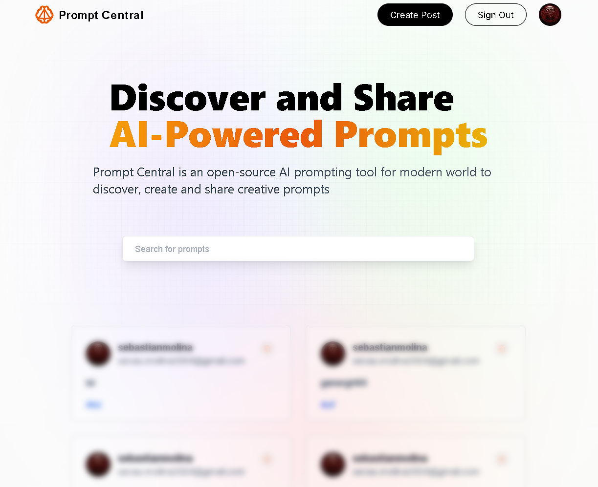

# Prompt Central 🧠

**Discover and Share AI-Powered Prompts**

Prompt Central is an open-source platform that allows users to explore, create, and share creative prompts for AI models. Whether you're an AI enthusiast, developer, or just curious, Prompt Central is the place to find inspiration and contribute your own ideas.



## Features

- **User Authentication**: Sign in securely using your Google account.
- **Create Prompts**: Easily create new prompts with associated tags.
- **Explore Prompts**: Browse a feed of prompts shared by the community.
- **Responsive Design**: Optimized for various devices and screen sizes.

## Technologies Used

- **Next.js**: Server-side rendering and static site generation.
- **React**: Building interactive user interfaces.
- **NextAuth.js**: Authentication handling with multiple providers.
- **MongoDB**: Database for storing user data and prompts.
- **Mongoose**: Object Data Modeling (ODM) library for MongoDB.
- **Tailwind CSS**: Utility-first CSS framework for styling.
- **TypeScript**: Type-safe JavaScript for improved code quality.

## Getting Started

Follow these instructions to get a copy of the project up and running on your local machine.

### Prerequisites

- **Node.js** and **npm** installed on your machine.
- **MongoDB Atlas** account or a local MongoDB server.
- **Google Cloud Console** account to obtain OAuth credentials.

### Installation

1. **Clone the Repository**

   ```bash
   git clone https://github.com/your-username/prompt-central.git
   cd prompt-central
   ```

2. **Install Dependencies**

   ```bash
   npm install
   ```

3. **Set Up Environment Variables**

   Create a .env

file in the root directory and add the following variables:

```env
GOOGLE_ID=your-google-client-id
GOOGLE_CLIENT_SECRET=your-google-client-secret
MONGODB_URI=your-mongodb-uri
NEXTAUTH_URL=http://localhost:3000
NEXTAUTH_SECRET=your-nextauth-secret
```

- **GOOGLE_ID** and **GOOGLE_CLIENT_SECRET**: Obtain these from the Google Cloud Console after setting up OAuth 2.0 credentials.
- **MONGODB_URI**: Your MongoDB connection string.
- **NEXTAUTH_SECRET**: A random secret key for NextAuth.js.

4. **Run the Development Server**

   ```bash
   npm run dev
   ```

   The application will start on `http://localhost:3000`.

## Usage

- **Sign In**

  Click on the "Sign in with Google" button to authenticate.

- **Create a Prompt**

  Navigate to the "Create Prompt" page to submit a new prompt. Fill in the prompt and associated tags.

- **Browse Prompts**

  Visit the home page to explore prompts submitted by other users.

## Contributing

Contributions are welcome! Please follow these steps:

1. **Fork the Repository**

   Click the "Fork" button at the top right of the repository page.

2. **Create a Feature Branch**

   ```bash
   git checkout -b feature/YourFeature
   ```

3. **Commit Your Changes**

   ```bash
   git commit -m "Add your message"
   ```

4. **Push to the Branch**

   ```bash
   git push origin feature/YourFeature
   ```

5. **Open a Pull Request**

   Go to the repository on GitHub and click "Compare & pull request".

## License

This project is licensed under the MIT License.

---

Feel free to customize this README file according to your project's specific needs.
