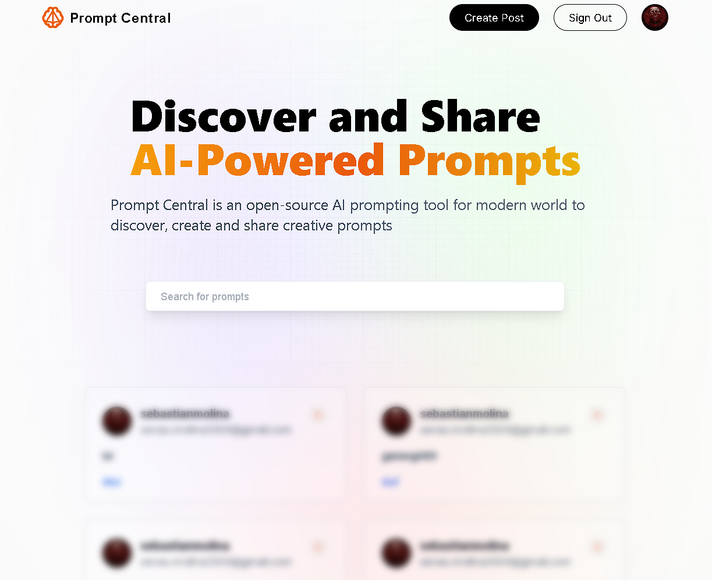

# Prompt Central 🧠

**Discover and Share AI-Powered Prompts**

Prompt Central is an open-source platform where users can explore, create, and share creative prompts for AI models. **Check out the live website:** [Prompt Central.](https://prompt-central.vercel.app/)



## Features

- **User Authentication:** Seamlessly sign in using your Google account.
- **Prompt Creation:** Easily create and submit new prompts with associated tags.
- **Prompt Feed:** Discover a collection of prompts shared by the community.
- **Prompt Search:** (Coming soon!)Filter prompts by title, tags, or author.
- **User Profiles:** (Coming soon!) View profiles of other users and the prompts they've shared.

## Technologies Used

- **Next.js:** A React framework for building performant and SEO-friendly web applications.
- **NextAuth.js:** Simplifies user authentication with various providers (currently using Google).
- **MongoDB:** A NoSQL database for storing user data and prompts.
- **Tailwind CSS:** A utility-first CSS framework for rapid UI development.
- **TypeScript:** A statically typed superset of JavaScript for improved code quality.

## Getting Started

To get a local copy up and running follow these simple steps.

### Prerequisites

- **Node.js and npm:** Make sure you have Node.js and npm (or yarn) installed on your machine.
- **MongoDB Account:** You'll need an active MongoDB account and a database to connect to.

### Installation

1. **Clone the Repository:**

   ```bash
   git clone https://github.com/sebastianmsz/prompt-central.git
   cd prompt-central
   ```

2. **Install Dependencies:**
   ```bash
   npm install
   ```
3. **Configure Environment Variables:**
   - Create a `.env` file in the root directory.
   - Add the following environment variables, replacing placeholders with your actual values:
     ```
     GOOGLE_ID=YOUR_GOOGLE_CLIENT_ID
     GOOGLE_CLIENT_SECRET=YOUR_GOOGLE_CLIENT_SECRET
     MONGODB_URI=YOUR_MONGODB_CONNECTION_STRING
     NEXTAUTH_URL=http://localhost:3000
     NEXTAUTH_URL_INTERNAL=http://localhost:3000
     NEXTAUTH_SECRET=YOUR_NEXTAUTH_SECRET
     ```
4. **Start the Development Server:**
   ```bash
   npm run dev
   ```
   The application will be available at `http://localhost:3000`.

## Contributing

Contributions are welcome! Please open an issue or submit a pull request if you'd like to contribute to the project.

## License

This project is licensed under the [MIT License](LICENSE).
